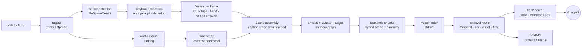

# Architecture

VideoMemory turns a video into **semantic temporal memory** that an LLM can query through MCP. The system never asks the model to look at the entire video — it retrieves a small set of semantic chunks and (optionally) a small set of keyframes per query.

## Pipeline



## Key design decisions

### Why a scene → event → chunk hierarchy?

Most video-RAG systems chunk by fixed time windows. That breaks two things:
1. **Temporal queries** ("after the OAuth discussion") need to anchor on semantically meaningful boundaries, not arbitrary 10-second slices.
2. **Frame recall** must be selective. If you can't tie a frame back to a scene + event, you can't say *why* you returned it.

VideoMemory's pipeline yields three primitives:

- **`Scene`** — visually coherent interval from PySceneDetect. Owns its keyframes, transcript window, OCR, objects, CLIP tags, and a multi-field embedding.
- **`Event`** — atomic temporal proposition: `subject verb object @ t_start..t_end`. Extracted from transcript verbs (template rules), OCR, or CLIP fallback. Consecutive duplicates merge.
- **`SemanticChunk`** — one or more consecutive scenes merged by **embedding similarity + entity overlap**, capped at 90s. Carries a summary, OCR excerpts, key events, and ≤3 keyframes.

Chunks are what the vector index stores. Events are what `events_relative_to(anchor, "after")` walks.

### Why does "what happened after X" work?

The retrieval router runs three substrategies:

```text
query → anchor_detector → if "after X": resolve X to a chunk by embedding → return chunks with start ≥ anchor.end
                       → else: multimodal fusion (semantic + transcript + OCR + visual) via RRF
```

The temporal anchor resolver is deliberately deterministic — it doesn't ask the LLM to "figure out the temporal structure," because the LLM doesn't see the timeline. The system supplies the timeline via deterministic event ordering.

Crucially, **"when was X"** is NOT a temporal anchor — it's a direct question about X's location. That distinction is in `retrieval/temporal_resolve.py`.

### Why frames as MCP resource URIs?

If `query_video` returned 8 frames as base64 PNGs, every call would inflate the token budget by tens of thousands of tokens. Instead frames are exposed as `videomemory://frames/<video_id>/<frame_id>.jpg` resource URIs. The MCP client fetches each only when it actually needs to render it.

### Why both `query_video` and `semantic_search`?

`query_video` does the full pipeline including (optional) LLM synthesis — useful for one-shot question answering from an agent.
`semantic_search` returns only ranked chunk IDs — useful when the agent wants to drive the loop itself (e.g., "search → pick top → ask for the transcript of that chunk → search again").

## Module map

| Path | Role |
|---|---|
| `videomemory/types.py` | All Pydantic schemas — single source of truth. |
| `videomemory/ingest/` | yt-dlp + ffprobe, deterministic video IDs. |
| `videomemory/video/` | Scene detection + entropy keyframe selection. |
| `videomemory/audio/` | Audio extraction + faster-whisper transcription. |
| `videomemory/vision/` | CLIP tags, OCR (rapidocr), YOLO (optional), templated captions. |
| `videomemory/memory/` | Entities, events, edges, semantic chunks. |
| `videomemory/embeddings/` | bge-small wrapper. |
| `videomemory/vector/` | `VectorStore` interface + Qdrant impl (local or server). |
| `videomemory/retrieval/` | Router, temporal resolver, RRF fusion, frame recall. |
| `videomemory/pipeline/` | Async stage runner with on-disk cache for resumability. |
| `videomemory/mcp/` | Official `mcp` SDK; stdio transport; 7 tools + frame resources. |
| `videomemory/api/` | FastAPI surface (same capabilities as MCP). |
| `videomemory/query/` | Provider-pluggable LLM synthesis (Ollama default). |
| `videomemory/exporters/` | Markdown / JSON / YAML / token-budgeted LLM context. |

## Deviations from a naive build

See the table in `README.md`. Highlights: `uv` over pip; rapidocr over Paddle on Apple Silicon; templated captions over heavy VLMs; stdio MCP transport first; on-disk stage cache instead of Celery.
